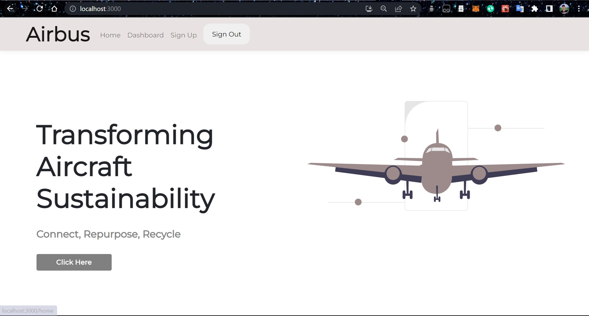
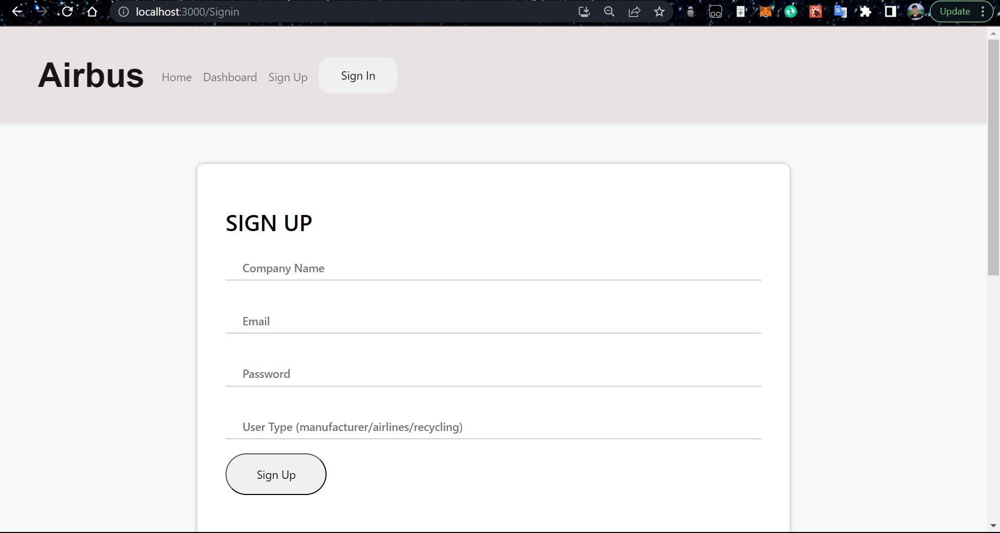
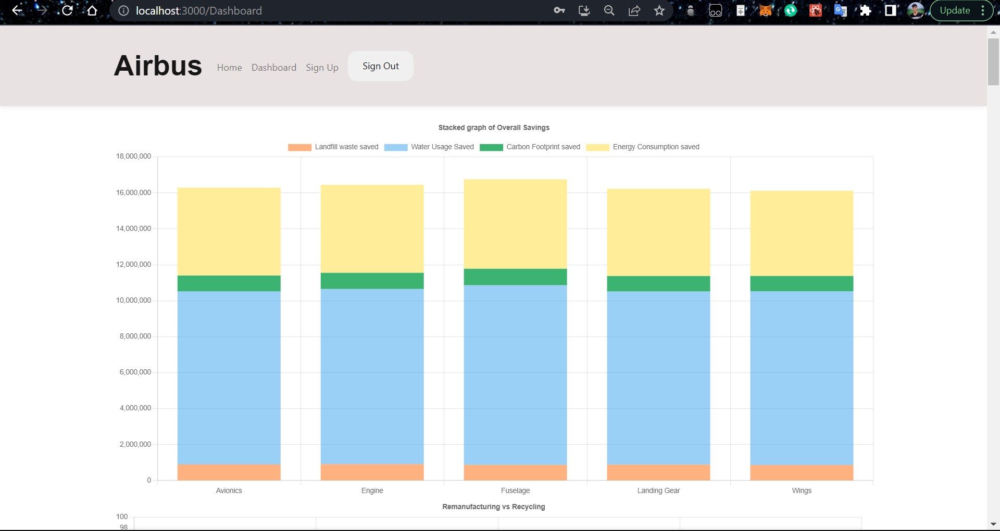
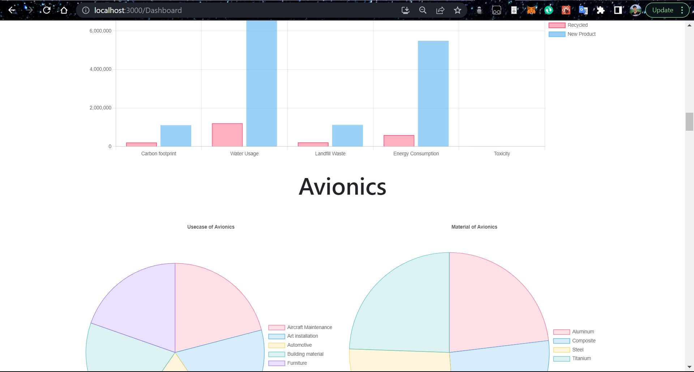
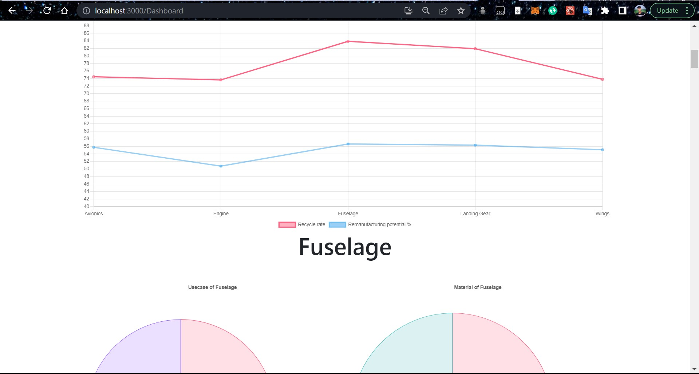
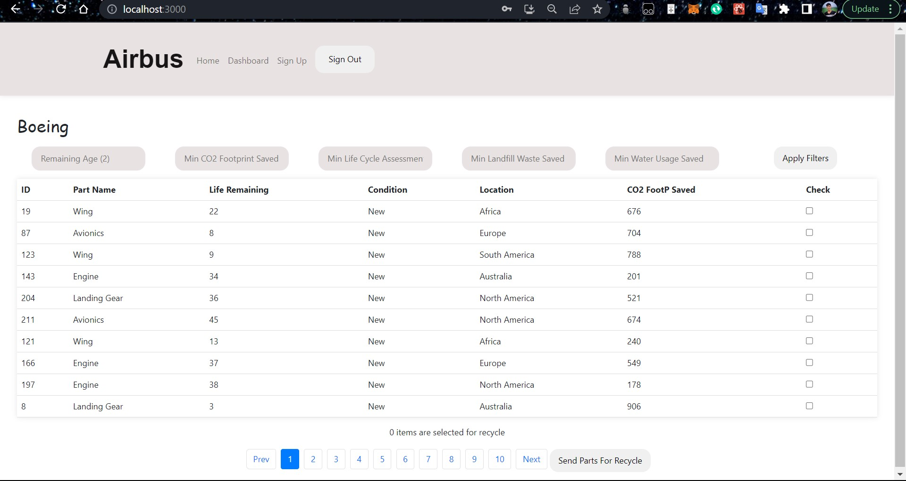
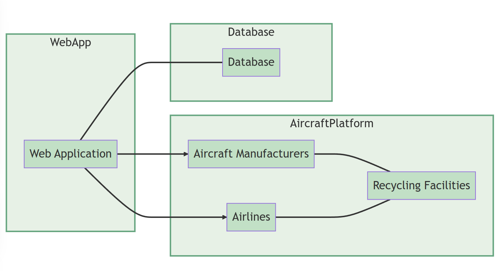
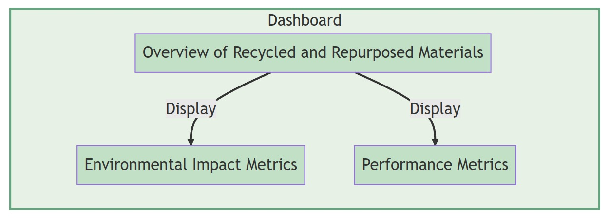
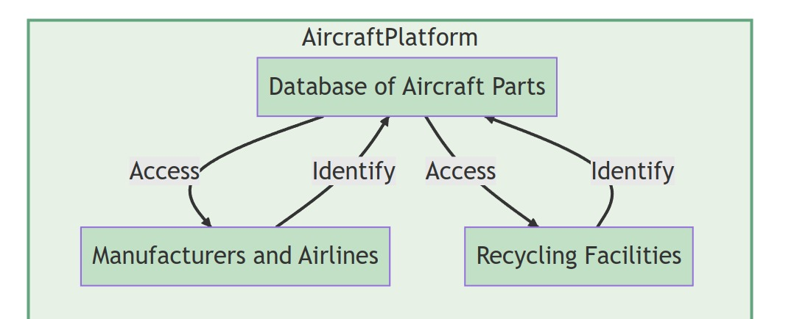
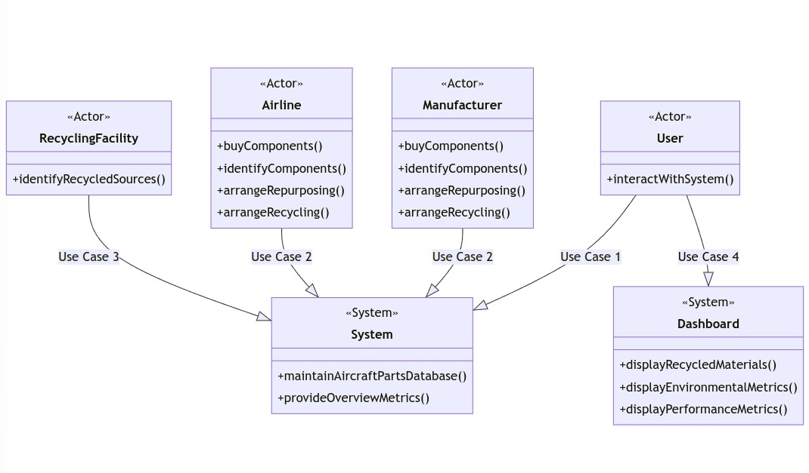

# Aircraft Sustainability Platform

The Aircraft Sustainability Platform is a web-based solution that connects aircraft manufacturers, airlines, and recycling facilities to facilitate the repurposing and recycling of end-of-life aircraft components. The platform aims to promote the circular economy by reducing waste and promoting sustainability in the aviation industry.

## Overview

The aviation industry is under increasing pressure to reduce its environmental impact, and one area where significant progress can be made is in the recycling and repurposing of end-of-life aircraft components. However, this process can be complex and requires coordination between multiple stakeholders. The Aircraft Sustainability Platform provides a centralized system for managing and optimizing the recycling and repurposing process.

## Key Features

- Database of Aircraft Parts: The platform includes a comprehensive database of aircraft parts, containing information on their material composition, age, condition, and other relevant details.

- Component Repurposing and Recycling: Manufacturers and airlines can buy or identify components that are nearing the end of their useful life and arrange for their repurposing or recycling through the platform.

- Source Identification for Recycling Facilities: Recycling facilities can identify sources of recycled materials, including metals, composites, plastics, and other non-metallic materials, through the platform.

- Circular Economy Dashboard: The platform provides a user-friendly dashboard that offers a clear and concise overview of key metrics and data related to the recycling and repurposing of end-of-life aircraft components. This includes information on recycled and repurposed materials, environmental impact metrics (CO2 emissions reduction, water usage reduction, landfill waste reduction), performance metrics (efficiency, processing time), and more.

## Security

- Secure Authentication: The platform implements secure authentication mechanisms, such as password hashing and salting, to protect user credentials and prevent unauthorized access. We used passport.js for authentication and bcrypt.js for hashing and salting.

- Role-Based Access Control: Different user roles (manufacturers, airlines, recycling facilities) are assigned appropriate permissions and access levels to ensure that each user can only perform authorized actions.

- Data Encryption: Sensitive data, such as user information and communication between the platform and the database, is encrypted using industry-standard encryption algorithms.

- Secure Communication: The platform uses secure communication protocols (e.g., HTTPS) to encrypt data transmitted between the server and clients, preventing eavesdropping and data tampering.

- Input Validation: The platform employs input validation techniques to prevent common security vulnerabilities like SQL injection and cross-site scripting (XSS) attacks using a combination of client-side and server-side validation.

- Regular Security Audits: Periodic security audits and vulnerability assessments are conducted to identify and address any potential security weaknesses or vulnerabilities using openvas.
## UI

### Landing Page

### SignUp page

### Dash Board Page

### Home Page

## Diagrams

### Deployment Diagram
A deployment diagram illustrates the physical deployment of software components and hardware nodes in a system. It provides a high-level view of how the system is distributed across different devices or servers. The deployment diagram shows how the various components, such as servers, databases, and external systems, are connected and interact with each other in the system.

### Flow Diagram
A flow diagram, also known as a process flowchart, illustrates the flow of activities or information in a system. It visualizes the sequence of steps or actions that occur within a process. The flow diagram depicts the flow of data or actions from one step to another, showing the order in which activities are performed and how they are interconnected. It helps in understanding the overall process flow and identifying potential bottlenecks or areas for improvement.

### Use Case Diagrams
Use case diagrams depict the interactions between system actors (users or external systems) and the system itself. They provide a visual representation of the system's functionality from the perspective of different actors. Use case diagrams show the different use cases or functionalities that the system offers, along with the actors involved in each use case. This helps in understanding the overall system behavior and the relationships between different actors and use cases.

## Getting Started

To get started with the Aircraft Sustainability Platform, follow these steps:

1. Clone the repository: `git clone https://github.com/AnuragRoshan/Aerothon`

2. Install the required dependencies by running `npm install` in the project directory of .

3. Configure the database connection and other settings in the configuration files.

4. Start the development server using `npm start`.

5. Access the platform through the provided URL or open it locally on your web browser.

## Technologies Used

- Frontend: HTML, CSS, JavaScript, React.js
- Backend: Node.js, Express.js
- Database: MongoDB
- Additional Libraries/Frameworks: Redux, Axios, Chart.js, Material-UI
- Security Frameworks- Passport.js, Bcrypt.js, Dotenv

## Contributing

This Project is made by:-
[Anurag Roshan](https://github.com/anuragroshan)
[Paras Guglani](https://github.com/parasguglani1)
[Shivam keshri](https://github.com/Shivam-1400)
[Satya Tiwari](https://github.com/iamsatyatiwari)

This project is made for the Final Round of Airbus Aerothon 5.0.

Contributions to the Aircraft Sustainability Platform project are welcome! If you have any ideas, suggestions, or bug reports, please feel free to open an issue or submit a pull request. Please make sure to follow the project's code of conduct.

## Security

If you discover any security-related issues or vulnerabilities, please contact the project team immediately at [@parasguglani1](<[github.com](https://github.com/parasguglani1)>). We appreciate your help in improving the security of the platform.

## License

The Aircraft Sustainability Platform is released under the [MIT License](LICENSE).
